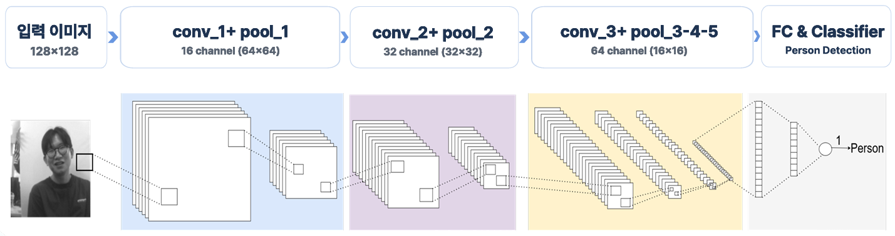
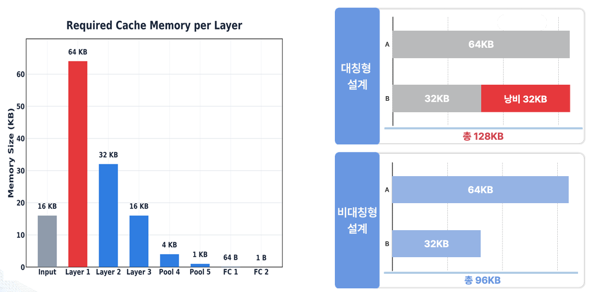
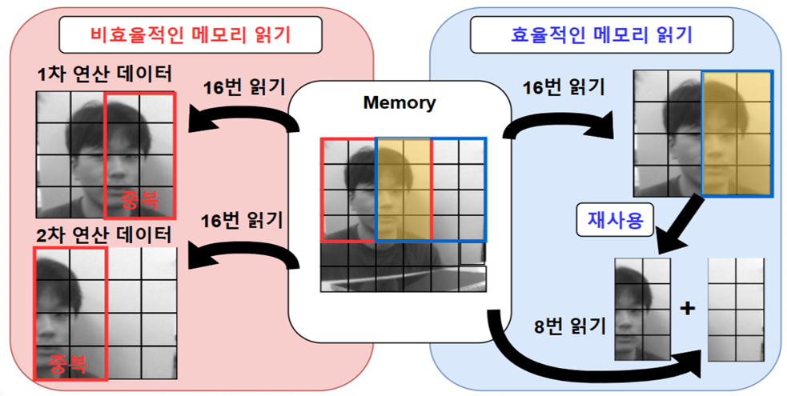
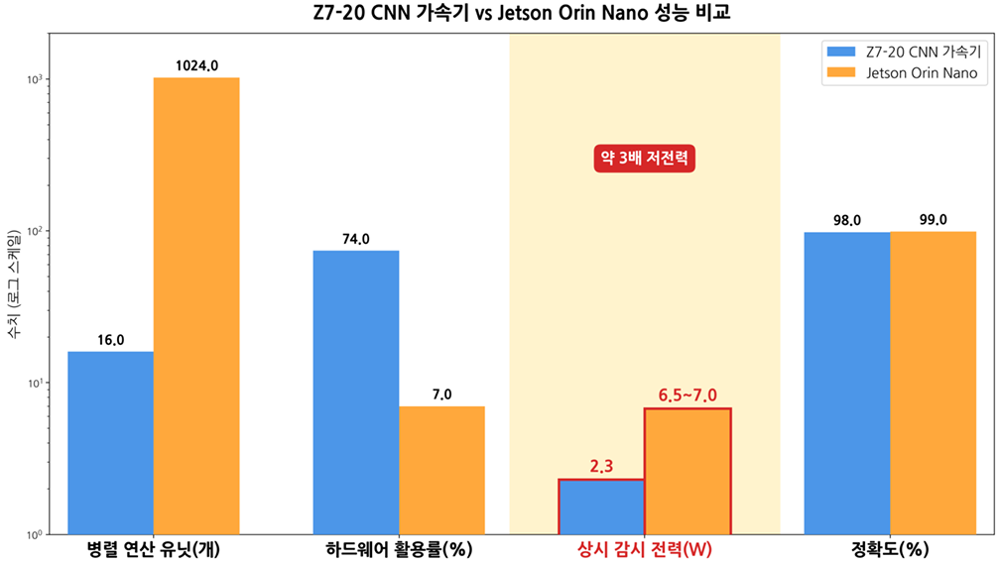
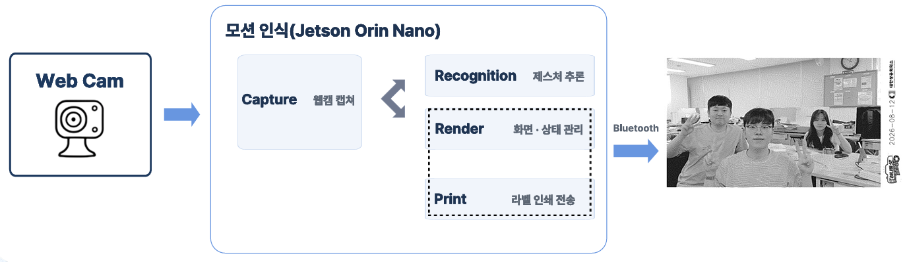
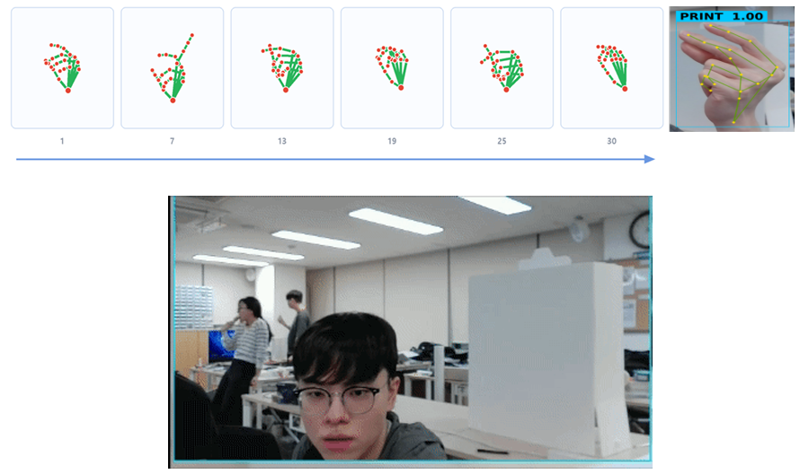
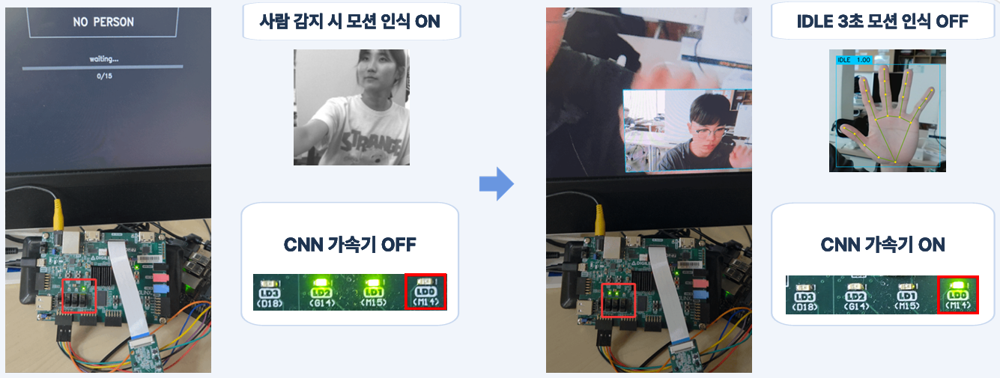
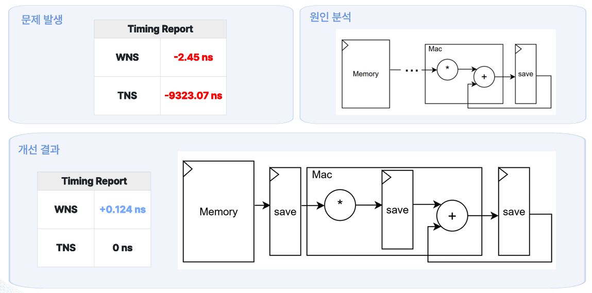

# 📸 저전력 CNN 가속기 기반 제스처 사진기

> FPGA 기반 저전력 사람 감지 CNN 가속기와 Jetson 기반 제스처 인식을 결합한 **비접촉식 AI 사진 촬영 시스템**
> **Team. 하나둘셋찰칵** | 대한상공회의소 서울기술교육센터 | 2026.08.20

<br>

## 📌 프로젝트 개요

**저전력 CNN 가속기 기반 제스처 사진기**는 무인 시스템의 상시 대기 전력과 터치 기반 조작의 한계를 개선하기 위해, **FPGA 기반 사람 감지 CNN 가속기**와 **Jetson Orin Nano 기반 제스처 인식 AI**를 결합한 시스템입니다.

대기 상태에서는 Pcam 영상을 Zybo Z7-20 FPGA에서 입력받아 CNN에 적합한 128×128 영상으로 전처리한 뒤, **INT8 CNN 가속기를 통해 사람의 유무를 판단**합니다.

사람이 감지되면 FPGA와 Jetson 간 Handshake를 통해 제스처 인식 시스템을 활성화하고, Jetson에서는 Webcam 영상과 MediaPipe Hands를 이용해 손 관절 정보를 추출한 뒤 **LSTM 모델로 사용자의 제스처를 분류**합니다.

사용자는 별도의 리모컨이나 터치 조작 없이 손동작만으로 화면 확대, 필터 선택, 사진 촬영을 수행할 수 있으며, 촬영한 이미지는 Bluetooth를 통해 Photo Printer로 전달하여 즉시 출력됩니다.

사용이 종료되면 다시 FPGA 기반 사람 감지 상태로 복귀하여, **고성능 AI 연산이 필요한 구간과 저전력 대기 구간을 분리한 제어 구조**를 구현했습니다.

<br>

## 🎯 프로젝트 목표

무인 시스템은 이용자가 없는 시간에도 고성능 연산 장치가 계속 동작할 경우 장시간 운영에 따른 대기 전력이 누적됩니다.

또한 촬영 위치와 조작 위치가 분리되어 있거나 별도의 터치 장치 및 리모컨을 사용하는 경우, 사용성과 유지보수 측면에서 불편이 발생할 수 있습니다.

이를 개선하기 위해 다음과 같은 구조를 적용했습니다.

* FPGA CNN 가속기를 이용한 상시 저전력 사람 감지
* 사람 감지 시에만 Jetson 기반 제스처 인식 AI 활성화
* 손 제스처를 이용한 비접촉 사진기 조작
* FPGA–Jetson 간 SPI 영상 통신 및 GPIO Handshake
* 촬영 이미지의 Bluetooth 기반 즉시 인화

<br>

## 👥 프로젝트 형태

**6인 팀 프로젝트**

|    이름   | 담당 역할                  |
| :-----: | ---------------------- |
| **최은수** | Z7-20과 Jetson 통합 및 최적화 |
| **이준형** | CNN 가속기 통합             |
| **곽은찬** | 인공지능 신경망 최적화           |
| **안정현** | Fully Connected 설계     |
| **윤지원** | Convolution 설계         |
| **최여지** | Pcam 영상 처리 & 이미지 통신    |

<br>

## 🙋 주요 담당

### Pcam 영상 처리 & FPGA–Jetson 이미지 통신

* Pcam 5C 영상 입력 및 Zybo Z7-20 연동
* MIPI CSI-2 기반 영상 입력 Pipeline 구성
* RGB 영상의 Grayscale 변환
* CNN 입력을 위한 128×128 영상 Downscale
* CNN 입력 영상용 Frame Buffer 연동
* FPGA의 128×128 Grayscale 영상을 Jetson으로 전달하는 SPI 통신 구현
* CNN 추론 결과 및 사람 감지 상태를 영상 Frame과 함께 전달
* FPGA–Jetson GPIO Handshake 연동
* Pcam–FPGA–Jetson 전체 영상 데이터 흐름 통합 및 검증

<br>

## 🛠 사용 기술

### FPGA & HDL

* Digilent Zybo Z7-20
* Xilinx Zynq-7000
* Verilog HDL
* SystemVerilog
* Xilinx Vivado
* AXI4-Stream
* BRAM
* FSM

### Camera & Image Processing

* Digilent Pcam 5C
* MIPI CSI-2
* MIPI D-PHY
* Bayer to RGB
* RGB to Grayscale
* Center Crop
* Downscale
* 128×128 Image Buffer

### AI

* INT8 CNN Accelerator
* Convolution
* Max Pooling
* Fully Connected Layer
* Requantization
* MediaPipe Hands
* LSTM
* TensorFlow / Keras

### Communication

* SPI
* GPIO Handshake
* Bluetooth

### Software

* Python
* OpenCV
* NumPy
* Jetson.GPIO
* spidev

### Hardware

* NVIDIA Jetson Orin Nano
* Webcam
* Photo Printer

<br>

# ⚙️ 시스템 구성

전체 시스템은 **사람 감지용 FPGA CNN 가속기**와 **제스처 인식용 Jetson AI**로 역할을 분리했습니다.

<p align="center">
  
</p>

<p align="center">
  <b>전체 시스템 동작 구조</b>
</p>

### FPGA - 사람 감지

Pcam에서 입력된 영상을 FPGA 내부에서 전처리한 후 CNN 가속기를 이용해 사람의 존재 여부를 판단합니다.

```text
Pcam 5C
   ↓
MIPI CSI-2
   ↓
Image Preprocessing
   ↓
128×128 Grayscale
   ↓
INT8 CNN Accelerator
   ↓
Person / Non-Person
```

### Jetson - 제스처 인식

사람이 감지된 경우 Jetson의 제스처 인식 시스템을 활성화합니다.

```text
Webcam
   ↓
MediaPipe Hands
   ↓
Hand Landmark
   ↓
Feature Extraction
   ↓
LSTM
   ↓
Gesture Classification
   ↓
Zoom / Select / Print / Idle
```

촬영한 이미지는 Bluetooth를 통해 Photo Printer로 전달하여 즉시 출력합니다.

<br>

## 🔄 저전력 제어 Loop

고성능 Jetson AI를 항상 동작시키지 않고 시스템 상태에 따라 FPGA와 Jetson의 동작을 전환합니다.

```text
[ Standby ]

FPGA CNN Accelerator : ON
Jetson Gesture AI     : OFF
          │
          │ Person Detection
          ▼
     GPIO Handshake
          │
          ▼
[ Active ]

FPGA CNN Accelerator : OFF
Jetson Gesture AI     : ON
          │
          │ Gesture Recognition
          ▼
 Zoom / Filter / Photo
          │
          │ Idle
          ▼
[ Standby ]

FPGA CNN Accelerator : ON
Jetson Gesture AI     : OFF
```

사람이 없는 대기 구간에서는 FPGA의 경량 CNN 가속기를 이용해 사람만 감지하고, 실제 사용자가 있을 때만 Jetson의 제스처 AI를 활성화하도록 구성했습니다.

<br>

# 🖼 Pcam 영상 처리

## 1. Pcam 영상 입력

Pcam 5C에서 입력되는 영상은 MIPI D-PHY와 CSI-2 Receiver를 거쳐 FPGA 내부 AXI4-Stream 영상 데이터로 전달됩니다.

```text
Pcam 5C
   ↓
MIPI D-PHY RX
   ↓
MIPI CSI-2 RX
   ↓
Bayer to RGB
   ↓
RGB Image Stream
```

<br>

## 2. RGB → Grayscale

CNN 입력 데이터량과 연산량을 줄이기 위해 RGB 영상을 Grayscale 영상으로 변환했습니다.

일반적인 Grayscale 가중치는 다음과 같습니다.

```text
Gray ≈ 0.299R + 0.587G + 0.114B
```

RTL에서는 부동소수점 연산 대신 정수 기반 연산으로 구성했습니다.

```text
Gray = (77R + 150G + 29B) / 256
```

<br>

## 3. 128×128 CNN 입력 영상 생성

입력 영상 전체를 CNN으로 전달하지 않고 중앙 영역을 추출한 뒤 Downscale하여 CNN 입력 영상을 생성합니다.

```text
Input Image
1280 × 720
     ↓
Center Crop
512 × 512
     ↓
4 Pixel Sampling
     ↓
CNN Input
128 × 128
```

생성된 128×128 Grayscale 영상은 FPGA 내부 Frame Buffer에 저장되어 CNN 입력과 Jetson SPI 영상 전송에 사용됩니다.

<br>

# 🧠 사람 탐지 CNN 가속기

사람 유무를 판단하는 목적에 맞춰 경량 CNN 구조를 FPGA에 구현했습니다.

<p align="center">
  
</p>

<p align="center">
  <b>사람 탐지를 위한 CNN 가속기 구조</b>
</p>

전체 연산 흐름은 다음과 같습니다.

```text
Input
128 × 128
   ↓
Conv 1 + Pool 1
16 Channel
   ↓
Conv 2 + Pool 2
32 Channel
   ↓
Conv 3 + Pooling
64 Channel
   ↓
Fully Connected
   ↓
Classifier
   ↓
Person / Non-Person
```

CNN 내부 Feature Map과 Weight는 INT8 기반으로 구성하여 Memory 사용량과 연산량을 줄였습니다.

Convolution 과정에서 생성되는 32-bit 누적값은 Requantization을 거쳐 다시 8-bit Feature Map으로 변환한 뒤 다음 Layer에서 사용합니다.

<br>

# 💾 CNN 가속기 최적화

## 1. 비대칭 Cache 구조

각 CNN Layer에서 요구하는 Feature Map 크기가 다르기 때문에 동일한 크기의 두 Memory를 사용하는 구조에서는 불필요한 Memory 공간이 발생합니다.

<p align="center">
  
</p>

<p align="center">
  <b>Layer별 Memory 요구량을 고려한 비대칭 Cache 구조</b>
</p>

기존 대칭형 Cache는 다음과 같이 구성됩니다.

```text
Memory A : 64 KB
Memory B : 64 KB
----------------
Total    : 128 KB
```

이를 Layer별 최대 Memory 요구량에 맞게 변경했습니다.

```text
Memory A : 64 KB
Memory B : 32 KB
----------------
Total    : 96 KB
```

그 결과 CNN Feature Buffer에 필요한 Cache Memory를 **128 KB에서 96 KB로 감소**시켰습니다.

<br>

## 2. 이전 Tile 재사용

Convolution 연산에서 인접한 연산 영역은 일부 Pixel 데이터를 공유합니다.

기존 구조에서는 다음 Tile의 연산을 수행할 때 이전 Tile과 중복되는 데이터까지 다시 Memory에서 읽어야 했습니다.

<p align="center">
  
</p>

<p align="center">
  <b>중복 Memory Access 감소를 위한 이전 Tile 재사용 구조</b>
</p>

```text
기존 방식

1차 연산 데이터 : 16회 Read
2차 연산 데이터 : 16회 Read
```

이전 Tile의 중복 데이터를 재사용하도록 변경했습니다.

```text
개선 방식

1차 연산 데이터 : 16회 Read
2차 신규 데이터 :  8회 Read
```

이를 통해 중복되는 Memory Access를 줄이고 CNN 연산 효율을 개선했습니다.

<br>

## 3. Requantization Shift-Add

Convolution의 MAC 연산 결과는 32-bit로 누적되지만 다음 CNN Layer에서는 다시 INT8 Feature Map이 필요합니다.

따라서 Requantization을 통해 32-bit 누적값을 8-bit 값으로 변환합니다.

```text
32-bit Accumulator
        ↓
Requantization
Shift + Add
        ↓
8-bit Feature
        ↓
Feature Buffer
```

일반적인 곱셈 연산 대신 Shift와 Add 연산을 활용하여 Hardware Resource와 Timing 부담을 줄였습니다.

<br>

# 📊 CNN 가속기 성능

Z7-20 CNN 가속기와 Jetson Orin Nano에서 사람 감지를 수행한 결과를 비교했습니다.

<p align="center">
  
</p>

<p align="center">
  <b>Z7-20 CNN 가속기와 Jetson Orin Nano 성능 비교</b>
</p>

| 항목       | Z7-20 CNN 가속기 | Jetson Orin Nano |
| -------- | ------------: | ---------------: |
| 병렬 연산 유닛 |            16 |             1024 |
| 하드웨어 활용률 |           74% |               7% |
| 상시 감지 전력 |     **2.3 W** |  **6.5 ~ 7.0 W** |
| 정확도      |       **98%** |          **99%** |

Jetson Orin Nano는 훨씬 많은 병렬 연산 자원을 보유하고 있지만, 사람 유무만 판단하는 상시 감지 작업에서는 전체 자원의 일부만 활용합니다.

Z7-20 기반 CNN 가속기는 사람 감지 정확도 **98%**를 유지하면서 상시 감지 전력을 **2.3 W** 수준으로 낮춰, Jetson Orin Nano 대비 약 **3배 낮은 전력**으로 사람 감지를 수행했습니다.

이를 기반으로 상시 감지는 FPGA가 담당하고, 복잡한 제스처 추론이 필요한 경우에만 Jetson을 활성화하도록 시스템을 구성했습니다.

<br>

# 🔌 FPGA–Jetson SPI 영상 통신

FPGA CNN 가속기에서 실제 입력으로 사용하는 **128×128 Grayscale 영상**을 Jetson의 대기 화면에서도 확인할 수 있도록 SPI 통신을 구현했습니다.

```text
Zybo Z7-20
SPI Slave
    │
    │ 128×128 Grayscale Image
    │ CNN Result
    ▼
Jetson Orin Nano
SPI Master
```

### SPI Frame 구성

하나의 128×128 Grayscale Frame은 총 **16,384 Byte**로 구성됩니다.

```text
128 × 128 = 16,384 Pixel
1 Pixel   = 8 bit
```

영상과 CNN 상태 정보를 동일한 Frame에서 전달하기 위해 마지막 4 Byte를 Telemetry 영역으로 사용했습니다.

|        Byte | 데이터                             |
| ----------: | ------------------------------- |
| `0 ~ 16379` | 128×128 Grayscale Image         |
|     `16380` | Tail Magic `0xA5`               |
|     `16381` | CNN Final Score                 |
|     `16382` | Person Count + Detection Result |
|     `16383` | XOR Checksum                    |

이를 통해 별도의 추가 Packet 없이 CNN 입력 영상과 추론 결과를 Jetson으로 함께 전달하도록 구성했습니다.

<br>

# ✋ AI 제스처 인식

Jetson Orin Nano에서는 Webcam 영상을 입력받아 MediaPipe Hands와 LSTM을 이용해 사용자의 손동작을 인식합니다.

<p align="center">
  
</p>

<p align="center">
  <b>Jetson 기반 AI 제스처 인식 시스템</b>
</p>

### 제스처 인식 흐름

```text
Webcam
   ↓
Frame Capture
   ↓
MediaPipe Hands
   ↓
21 Hand Landmarks
   ↓
Feature Extraction
   ↓
30 Frame Sequence
   ↓
LSTM
   ↓
Gesture Classification
```

MediaPipe를 이용하여 손의 **21개 Landmark**를 추출하고, 좌표 정보와 관절 각도를 이용해 한 Frame당 **78개의 Feature**를 구성합니다.

연속적인 움직임을 인식하기 위해 단일 Frame이 아닌 30 Frame Sequence를 사용합니다.

<br>

## LSTM Gesture Recognition

<p align="center">
  
</p>

<p align="center">
  <b>30 Frame Sequence 기반 LSTM 제스처 분류 구조</b>
</p>

```text
Input
30 × 78
   ↓
LSTM 64
Dropout 0.3
   ↓
LSTM 64
Dropout 0.3
   ↓
Dense 32
ReLU
Dropout 0.2
   ↓
Softmax 4
```

### Gesture Class

| Gesture  | 기능            |
| -------- | ------------- |
| `idle`   | 기본 상태 및 세션 종료 |
| `print`  | 사진 촬영         |
| `zoom`   | 화면 확대 / 축소    |
| `select` | 필터 선택         |

<br>

# 🤝 FPGA–Jetson Handshake

FPGA의 사람 감지 CNN과 Jetson의 제스처 인식 AI가 동시에 계속 동작하지 않도록 GPIO 기반 Handshake를 적용했습니다.

<p align="center">
  
</p>

<p align="center">
  <b>사람 감지 CNN과 제스처 AI의 동작 전환</b>
</p>

### 사람 감지 시

```text
FPGA CNN
Person Detection
      ↓
GPIO Trigger
      ↓
Jetson Gesture AI ON
      ↓
FPGA CNN OFF
```

### 사용자 종료 시

```text
Idle State
     ↓
Jetson Gesture AI OFF
     ↓
GPIO RUN LOW
     ↓
FPGA CNN ON
```

순간적인 Person 오검출에 의해 시스템이 실행되는 것을 줄이기 위해 연속적인 감지 결과를 기반으로 Trigger를 발생시키도록 구성했습니다.

<br>

# 📷 제스처 기반 사진기 기능

## 🔍 Zoom

`zoom` 제스처를 인식하면 촬영 화면의 확대 상태를 변경합니다.

```text
Zoom Gesture
     ↓
Zoom ON / OFF
```

<br>

## 🎨 Filter

`select` 제스처를 통해 Filter 선택 모드를 활성화하고 사용자의 손 위치에 따라 촬영 효과를 선택합니다.

<br>

## 📸 Print

`print` 제스처가 인식되면 Countdown 후 사진을 촬영합니다.

```text
Print Gesture
      ↓
     3
     2
     1
      ↓
Photo Capture
      ↓
Bluetooth
      ↓
Photo Printer
```

촬영된 이미지는 Bluetooth를 통해 Photo Printer로 전달하여 즉시 인화합니다.

<br>

# ⚠️ 문제 해결

## 1. CNN Critical Path - TNS 해결

CNN MAC 연산에서 Memory Read부터 Multiply, Accumulate까지 긴 조합 경로가 형성되면서 Timing Violation이 발생했습니다.

<p align="center">
  
</p>

<p align="center">
  <b>Pipeline 적용 전후 Timing 개선 결과</b>
</p>

### 개선 전

```text
WNS : -2.45 ns
TNS : -9323.07 ns
```

Memory와 MAC 연산 사이에 Pipeline Register를 추가하여 긴 Critical Path를 여러 Stage로 분리했습니다.

### 개선 후

```text
WNS : +0.124 ns
TNS : 0 ns
```

Timing Violation을 제거하여 FPGA에서 CNN 가속기가 안정적으로 동작할 수 있도록 개선했습니다.

<br>

## 2. SPI 16 KiB 전송 문제

Jetson에서 16 KiB보다 큰 SPI 데이터를 한 번에 읽을 경우 SPI Transaction이 분할되면서 CS가 변경되고, FPGA의 Frame Address가 초기화되어 영상 데이터가 처음부터 반복되는 문제가 발생했습니다.

### 해결

* 전체 SPI Frame 크기를 **16,384 Byte**로 고정
* 마지막 4 Byte를 CNN Telemetry 영역으로 활용
* Magic Byte와 XOR Checksum으로 Frame 정렬 및 데이터 검증

이를 통해 별도의 Frame 크기 증가 없이 영상과 CNN 상태 데이터를 안정적으로 전달했습니다.

<br>

## 3. 제스처 인식 FPS 개선

AI 추론이 영상 Capture와 Rendering 과정에 직접 영향을 주면서 전체 영상 처리 속도가 저하되는 문제가 발생했습니다.

Capture / Render와 Recognition 흐름을 분리하여 AI 추론이 화면 출력 전체를 Blocking하지 않도록 개선했습니다.

최종적으로 약 **15 FPS 수준의 실시간 영상 처리 및 제스처 인식**을 확인했습니다.

<br>

# 🧪 검증 내용

## CNN 기능 검증

SystemVerilog Testbench를 이용하여 Person / Non-Person Dataset에 대한 CNN 동작을 검증했습니다.

```text
Person Dataset      : 100 Images
Non-Person Dataset  : 100 Images
--------------------------------
Total               : 200 Images
Image Size          : 128 × 128
```

### 검증 항목

* 128×128 Image Memory Load
* CNN `start / busy / done` Handshake
* 각 CNN Layer의 정상 동작 확인
* Person / Non-Person 결과 비교
* Signed INT8 최종 Score 확인
* Timeout 기반 Deadlock 검출
* Person / Non-Person Pass Rate 계산
* Threshold Sweep
* TP / TN / FP / FN 기반 결과 비교

최종 시스템에서 사람 탐지 정확도 **98%**를 확인했습니다.

<br>

## 시스템 통합 검증

* Pcam 영상 입력 확인
* AXI4-Stream 영상 전달 확인
* RGB → Grayscale 변환 확인
* 128×128 CNN 입력 영상 생성 확인
* FPGA CNN Person Detection 확인
* SPI 기반 FPGA → Jetson 영상 전달 확인
* CNN Score 및 Detection Result 전달 확인
* GPIO Handshake 동작 확인
* 사람 감지 시 Jetson 제스처 AI 활성화 확인
* Idle 상태에서 FPGA CNN 감지 모드 복귀 확인
* MediaPipe Hand Landmark 추출 확인
* LSTM Gesture Classification 확인
* 사진 촬영 및 Bluetooth Printer 출력 확인

<br>

# 🎥 시연 영상

<p align="center">
  <a href="YOUR_YOUTUBE_LINK">
    
  </a>
</p>

<p align="center">
  <i>이미지를 클릭하면 YouTube에서 전체 시연 영상을 확인할 수 있습니다.</i>
</p>

시연에서는 다음 전체 동작을 확인할 수 있습니다.

* Pcam 기반 사람 감지 영상 입력
* FPGA CNN 가속기의 Person Detection
* SPI 기반 FPGA–Jetson 영상 전달
* 사람 감지에 따른 FPGA CNN ↔ Jetson 제스처 AI 동작 전환
* MediaPipe + LSTM 기반 손 제스처 인식
* 손 제스처를 이용한 Zoom / Filter / Print 제어
* 사진 촬영 및 Bluetooth 즉시 인화
* 사용자 종료 후 저전력 CNN 감지 상태 복귀

<br>

# 📂 소스코드 구조

FPGA 기반 사람 탐지 CNN 가속기와 Jetson 기반 제스처 인식 소스를 구분하고, CNN 기능 검증을 위한 Testbench와 검증 데이터를 별도로 구성했습니다.

```text
src/
├── src/
│   ├── fpga/
│   │   ├── cnn/
│   │   │   ├── CNN_accelerator.v
│   │   │   ├── CNN_acc_controller.sv
│   │   │   ├── Buffer.sv
│   │   │   ├── padding.sv
│   │   │   ├── requantize.sv
│   │   │   │
│   │   │   ├── conv/
│   │   │   │   ├── CH.sv
│   │   │   │   ├── CH_Result_Buffer.sv
│   │   │   │   ├── CH_wrapper.sv
│   │   │   │   ├── conv.sv
│   │   │   │   ├── Conv_Controller.sv
│   │   │   │   ├── Feature_Buffer_Mux.sv
│   │   │   │   ├── MaxPool_2x2.sv
│   │   │   │   ├── MaxPool_wrapper.sv
│   │   │   │   ├── Output_Mux.sv
│   │   │   │   ├── Shift_Buffer.sv
│   │   │   │   ├── Standalone_MaxPool.sv
│   │   │   │   └── Weight_Loader.sv
│   │   │   │
│   │   │   └── fc/
│   │   │       ├── fc.sv
│   │   │       ├── fc_controller.sv
│   │   │       ├── fc_core.sv
│   │   │       ├── fc_memory_adapter.sv
│   │   │       ├── fc_output_buffer.sv
│   │   │       ├── fc_pe.sv
│   │   │       ├── fc_pe_array.sv
│   │   │       └── fc_quantizer.sv
│   │   │
│   │   ├── preprocess/
│   │   │   ├── rgb2gray.v
│   │   │   ├── ds_128.v
│   │   │   └── gray_128x128.v
│   │   │
│   │   ├── interface/
│   │   │   ├── jetson_controller.v
│   │   │   └── spi_frame_tx.v
│   │   │
│   │   ├── memory/
│   │   │   └── int8_weights_conv_fc_be64.mem
│   │   │
│   │   └── bd/
│   │       ├── system.bd
│   │       └── system_wrapper.vhd
│   │
│   └── jetson/
│       ├── gesture_print_b1pro.py
│       ├── cnn_image.py
│       ├── hand_feature.py
│       ├── create_dataset.py
│       ├── train_6people.py
│       └── niimbot_b1pro.py
│
└── verification/
    └── cnn/
        ├── tb/
        │   └── tb_CNN_all_imge.sv
        │
        ├── scripts/
        │   ├── img2mem.py
        │   ├── filelist.f
        │   └── Makefile
        │
        └── test_data/
            ├── person/
            │   └── person*.mem
            └── non_person/
                └── non_person*.mem
```

### 폴더 설명

| 폴더                               | 내용                                                               |
| -------------------------------- | ---------------------------------------------------------------- |
| `src/src/fpga/cnn`               | INT8 기반 사람 탐지 CNN 가속기의 전체 제어 및 연산 RTL                            |
| `src/src/fpga/cnn/conv`          | Convolution, Max Pooling, Weight Loading 및 Feature Buffer 관련 RTL |
| `src/src/fpga/cnn/fc`            | Fully Connected Layer 및 Quantization 관련 RTL                      |
| `src/src/fpga/preprocess`        | Pcam 입력 영상의 Grayscale 변환 및 128×128 Downscale                     |
| `src/src/fpga/interface`         | FPGA–Jetson SPI 영상 통신 및 GPIO Handshake                           |
| `src/src/fpga/memory`            | CNN 연산에 사용하는 INT8 Weight Memory                                  |
| `src/src/fpga/bd`                | Zybo Z7-20 기반 Vivado Block Design 및 Top Wrapper                  |
| `src/src/jetson`                 | 제스처 인식, SPI 영상 수신, Dataset 생성·학습 및 Printer 제어 Python 코드          |
| `src/verification/cnn/tb`        | CNN Person / Non-Person 기능 검증용 SystemVerilog Testbench           |
| `src/verification/cnn/scripts`   | Image Memory 변환 및 Simulation 실행 Script                           |
| `src/verification/cnn/test_data` | Person / Non-Person CNN 검증용 128×128 Memory 데이터                   |

> Vivado에서 자동 생성되는 `.cache`, `.gen`, `.runs`, `.sim`, `.hw`, `.Xil`, IP 생성 파일 및 Simulation Netlist는 소스코드에서 제외했습니다.

<br>

# 💡 프로젝트를 통해 배운 점

상시 동작하는 시스템에서 모든 AI 연산을 고성능 프로세서에 맡기는 것보다, 연산의 특성과 복잡도에 따라 FPGA와 Jetson의 역할을 분리하는 것이 전력 효율 측면에서 효과적이라는 점을 확인했습니다.

프로젝트를 통해 다음 내용을 경험했습니다.

* Pcam 5C와 Zybo Z7-20을 이용한 실시간 영상 입력 및 처리
* AXI4-Stream 기반 영상 Data Flow 구성
* FPGA 기반 Grayscale 및 128×128 영상 전처리
* INT8 CNN Accelerator 구조 및 Hardware Inference
* 제한된 FPGA Memory를 고려한 비대칭 Cache 구조 설계
* 이전 Tile 재사용을 통한 Memory Access 감소
* Shift-Add 기반 Requantization
* Pipeline 적용을 통한 Critical Path 및 Timing 개선
* FPGA 기반 저전력 Person Detection
* SPI 기반 FPGA–Jetson 영상 통신
* GPIO 기반 Hardware–Software Handshake
* MediaPipe와 LSTM 기반 Gesture Recognition
* FPGA와 Jetson의 역할 전환을 이용한 저전력 제어 Loop
* Camera–FPGA–Jetson–Printer 전체 시스템 통합 및 실제 시연

<br>

## 📄 발표 자료

전체 시스템 설계와 CNN 가속기 최적화, 제스처 인식 및 문제 해결 과정은 아래 발표 자료에서 확인할 수 있습니다.

<p align="center">
  <a href="./docs/Final_Project.pdf">
    <b>📑 프로젝트 발표 자료 보기</b>
  </a>
</p>

<br>

## 📜 출처 및 참고

* Digilent Zybo Z7-20
* Digilent Pcam 5C
* NVIDIA Jetson Orin Nano
* MediaPipe Hands
* TensorFlow / Keras
* OpenCV
* Xilinx Vivado
* 본 프로젝트는 6인 팀 프로젝트로 수행되었습니다.

---

*FPGA 기반 저전력 사람 감지와 Jetson 제스처 AI를 결합한 비접촉식 AI 사진 촬영 시스템*
