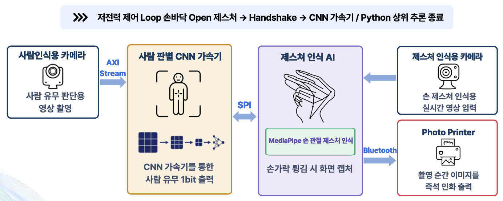
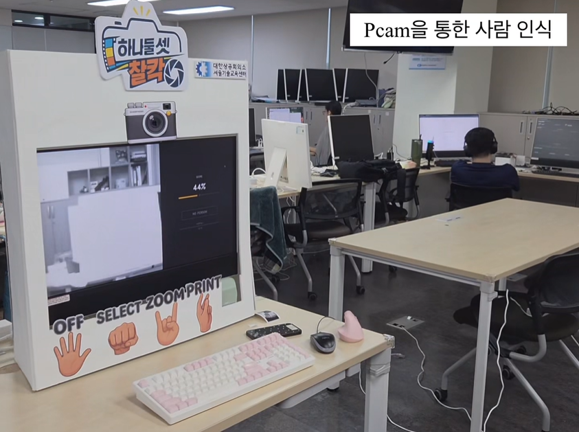

# 📸 저전력 CNN 가속기 기반 제스처 사진기

> FPGA 기반 사람 감지 CNN 가속기와 Jetson 기반 제스처 인식을 결합한 **비접촉식 AI 사진 촬영 시스템**  
> **Team. 하나둘셋찰칵** | 대한상공회의소 서울기술교육센터 | 2026.08.20

<br>

## 📌 프로젝트 개요

**저전력 CNN 가속기 기반 제스처 사진기**는 FPGA에서 사람의 유무를 감지하고, 사람이 감지된 경우 Jetson Orin Nano의 제스처 인식 기능을 연동하여 비접촉으로 사진을 촬영하는 6인 팀 프로젝트입니다.

Pcam 5C로 입력된 영상은 Zybo Z7-20 FPGA에서 CNN 입력에 맞는 **128×128 Grayscale 이미지**로 전처리되며, 사람 감지 결과에 따라 Jetson의 제스처 인식 단계와 연동됩니다.

<p align="center">
  
</p>

<p align="center">
  <b>전체 시스템 구성</b>
</p>

> **이 README는 팀 전체 기능 중 제가 담당한 `Pcam 영상 처리`와 `FPGA–Jetson 이미지 통신`을 중심으로 정리했습니다.**  
> CNN 가속기 내부 연산, Jetson 제스처 인식 모델, 프린터 제어 등은 전체 시스템 구성 요소로만 소개하고 상세 구현 설명은 생략했습니다.

<br>

## 👥 프로젝트 형태 및 역할

**6인 팀 프로젝트**

| 이름 | 담당 역할 |
| :---: | --- |
| 최은수 | Z7-20과 Jetson 통합 및 최적화 |
| 이준형 | CNN 가속기 통합 |
| 곽은찬 | 인공지능 신경망 최적화 |
| 안정현 | Fully Connected 설계 |
| 윤지원 | Convolution 설계 |
| **최여지** | **Pcam 영상 처리 & 이미지 통신** |

<br>

## 🙋 담당 역할

### Pcam 영상 처리 & FPGA–Jetson 이미지 통신

- Pcam 5C 영상 입력 및 FPGA 영상 처리 경로 연동
- RGB 영상의 Grayscale 변환
- CNN 입력을 위한 128×128 이미지 데이터 구성
- 128×128 Image Buffer와 CNN 가속기 입력 연동
- FPGA의 이미지 데이터를 SPI를 통해 Jetson Orin Nano로 전달
- Pcam → FPGA 전처리 → CNN 입력 → Jetson 이미지 전달까지 데이터 흐름 확인

<br>

## 🛠 사용 기술

| 구분 | 사용 기술 |
| --- | --- |
| HDL / FPGA | Verilog HDL, Zybo Z7-20, Zynq-7000, Vivado |
| Camera / Video | Pcam 5C, AXI4-Stream, RGB to Grayscale, Downscale |
| Memory | 128×128 Image Buffer, Block RAM |
| Communication | SPI |
| Target | Jetson Orin Nano |

<br>

# 🖼 Pcam 영상 처리

## 1. RGB → Grayscale

Pcam 영상 처리 경로에서 RGB 데이터를 CNN 입력에 사용할 Grayscale 데이터로 변환했습니다.

`rgb2gray.v`에서는 부동소수점 연산 대신 정수 가중치를 사용하여 Grayscale 값을 계산합니다.

```text
Gray = (77R + 150G + 29B + 128) / 256
```

AXI4-Stream의 `tvalid`, `tready`, `tlast`, `tuser` 신호를 함께 전달하여 영상 Stream의 흐름이 유지되도록 구성했습니다.

관련 RTL:

```text
src/src/fpga/preprocess/rgb2gray.v
```

<br>

## 2. 128×128 CNN 입력 영상 구성

입력 영상 전체를 CNN에 사용하지 않고 중앙 영역을 추출한 뒤 일정 간격으로 Pixel을 선택하여 128×128 영상을 생성했습니다.

```text
1280 × 720 Input
       ↓
512 × 512 Center Crop
       ↓
4 Pixel Sampling
       ↓
128 × 128 CNN Input
```

`ds_128.v`에서는 입력 크기 `1280×720`, Crop 영역 `512×512`, Sampling 간격 `4`를 기준으로 CNN 입력 데이터를 구성합니다.

관련 RTL:

```text
src/src/fpga/preprocess/ds_128.v
```

<br>

## 3. 128×128 Image Buffer 연동

생성된 128×128 Grayscale 영상은 FPGA 내부 Image Buffer에 저장하여 **CNN 입력과 SPI 이미지 전송에서 함께 접근할 수 있도록** 구성했습니다.

```text
Pcam Image Stream
       ↓
Grayscale / Downscale
       ↓
128×128 Image Buffer
     ┌───────┴───────┐
     ↓               ↓
CNN Read          SPI Read
```

한 Frame의 크기는 다음과 같습니다.

```text
128 × 128 Pixel = 16,384 Pixel
1 Pixel         = 8 bit
```

`gray_128x128.v`에서는 16,384 Byte Image Buffer를 Block RAM 형태로 구성하고, CNN Read Address와 SPI Read Address를 각각 받아 데이터를 제공하도록 구현했습니다.

CNN 입력 시에는 저장된 8-bit Gray 값에서 `128`을 빼 signed INT8 형태로 전달합니다.

관련 RTL:

```text
src/src/fpga/preprocess/gray_128x128.v
```

<br>

# 🔌 FPGA–Jetson SPI 이미지 통신

FPGA의 128×128 Grayscale 이미지를 Jetson Orin Nano로 전달하기 위해 SPI 통신을 사용했습니다.

```text
Zybo Z7-20 FPGA
SPI Slave
     │
     │ 128×128 Grayscale Frame
     ▼
Jetson Orin Nano
SPI Master
```

Jetson이 SPI Master로 동작하며, FPGA는 Image Buffer의 주소를 순차적으로 증가시키면서 이미지 데이터를 전달합니다.

관련 RTL:

```text
src/src/fpga/interface/spi_frame_tx.v
```

<br>

## SPI Frame 구성

한 번의 SPI Frame 크기는 **16,384 Byte**로 고정했습니다.

마지막 4 Byte는 이미지 영역 안에서 상태 정보를 전달하는 Telemetry 영역으로 사용합니다.

| Byte | 데이터 |
| ---: | --- |
| `0 ~ 16379` | 128×128 Grayscale Image |
| `16380` | Tail Magic `0xA5` |
| `16381` | CNN Final Score |
| `16382` | Person Count + Detection Result |
| `16383` | XOR Checksum |

이미지 Frame 크기를 유지하면서 CNN 상태 정보를 함께 전달하도록 구성했습니다.

<br>

# ⚠️ 문제 해결

## SPI 16 KiB 전송 문제

Jetson에서 16 KiB보다 큰 SPI 데이터를 한 번에 읽을 경우 Transaction이 분할되면서 CS가 변경되고, FPGA의 Frame Address가 초기화되어 영상 데이터가 처음부터 반복되는 현상을 확인했습니다.

이를 해결하기 위해 다음과 같이 수정했습니다.

- SPI Frame 전체 크기를 **16,384 Byte**로 고정
- 추가 상태 데이터는 Frame 뒤에 붙이지 않고 마지막 4 Byte에 포함
- `0xA5` Magic Byte와 XOR Checksum을 이용해 Frame 정렬과 데이터 상태 확인
- CS가 유지되는 동안 Frame Address를 순차적으로 증가시키고 CS 해제 시 Address를 초기화

이를 통해 128×128 이미지와 상태 데이터를 하나의 고정된 SPI Frame으로 전달하도록 구성했습니다.

<br>

# 🧪 검증 및 결과

담당한 영상 처리 및 이미지 통신 구간을 중심으로 다음 동작을 확인했습니다.

- Pcam 영상 입력 후 FPGA 영상 처리 경로 전달 확인
- RGB → Grayscale 변환 확인
- 128×128 CNN 입력 이미지 생성 확인
- Image Buffer 저장 및 CNN 입력 데이터 전달 확인
- FPGA → Jetson SPI 이미지 전송 확인
- 실제 시스템에서 사람 감지 결과와 Jetson 제스처 인식 단계가 연동되는 동작 확인

<br>

# 🎥 시연 영상

<p align="center">
  <a href="https://youtu.be/W_Af24NF-nc">
    
  </a>
</p>

<p align="center">
  <i>이미지를 클릭하면 전체 시스템 시연 영상을 확인할 수 있습니다.</i>
</p>

<br>

# 📂 담당 코드

전체 Repository에는 6인 팀 프로젝트의 통합 소스가 포함되어 있으며, 아래 파일은 이 README에서 설명한 **Pcam 영상 처리 및 FPGA–Jetson 이미지 통신**과 직접 연결된 코드입니다.

```text
src/src/fpga/
├── preprocess/
│   ├── rgb2gray.v
│   ├── ds_128.v
│   └── gray_128x128.v
│
└── interface/
    └── spi_frame_tx.v
```

| 파일 | 역할 |
| --- | --- |
| `rgb2gray.v` | RGB 영상의 Grayscale 변환 |
| `ds_128.v` | Center Crop 및 128×128 Downscale |
| `gray_128x128.v` | 128×128 Image Buffer, CNN/SPI Read 연동 |
| `spi_frame_tx.v` | FPGA → Jetson SPI Frame 이미지 전송 |

> Repository의 `cnn`, `jetson`, `verification` 등 다른 디렉터리에는 팀 전체 프로젝트의 통합 소스가 포함되어 있습니다.

<br>

## 📄 발표 자료

전체 시스템 구성과 팀 프로젝트 결과는 아래 발표 자료에서 확인할 수 있습니다.

<p align="center">
  <a href="./docs/Final_Project.pdf">
    <b>📑 프로젝트 발표 자료 보기</b>
  </a>
</p>

<br>

## 💡 프로젝트를 통해 배운 점

- 카메라 영상이 FPGA 내부에서 CNN 입력 데이터로 변환되는 전체 Data Flow를 경험했습니다.
- AXI4-Stream 기반 영상 신호와 Frame 단위 데이터 처리 과정을 이해했습니다.
- 하나의 Image Buffer를 CNN 입력과 SPI 이미지 통신에 연결하면서 모듈 간 데이터 흐름을 확인했습니다.
- FPGA와 Jetson 간 SPI 통신을 구현하며 Frame 크기와 CS 제어가 실제 데이터 전송에 미치는 영향을 확인했습니다.
- 담당 모듈의 기능 구현뿐 아니라 다음 처리 단계까지 데이터가 정상 전달되는지 확인하는 과정의 중요성을 배웠습니다.

---

*Pcam 영상 처리와 FPGA–Jetson 이미지 통신을 중심으로 정리한 프로젝트 Repository입니다.*